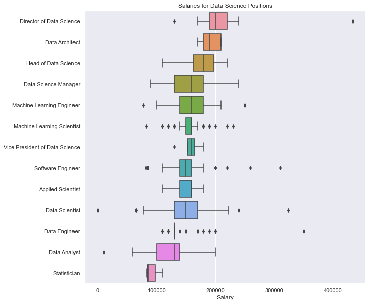
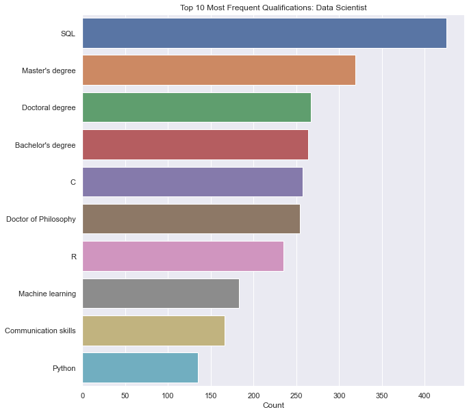
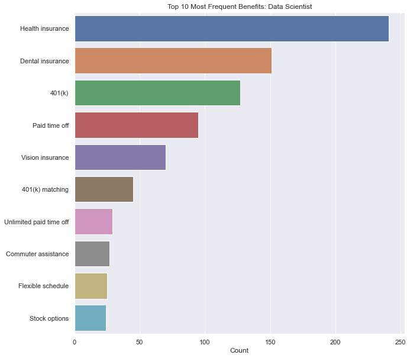
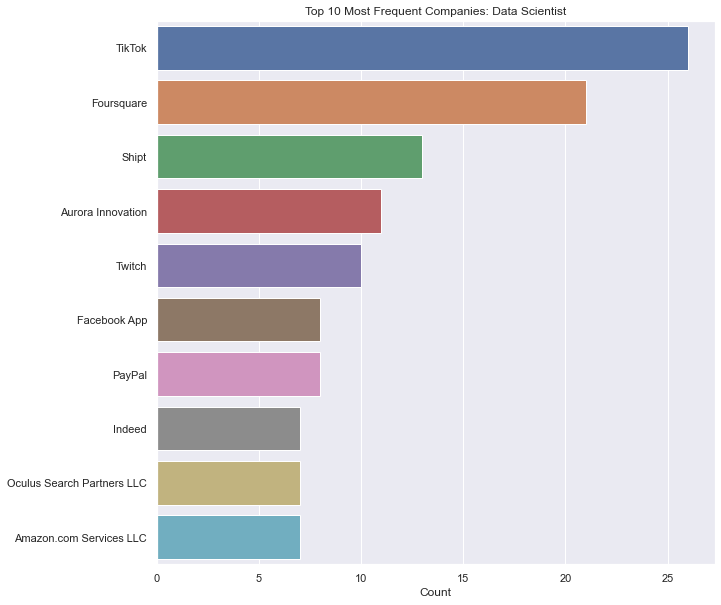
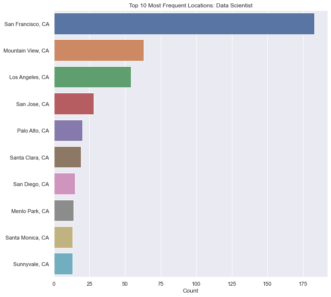
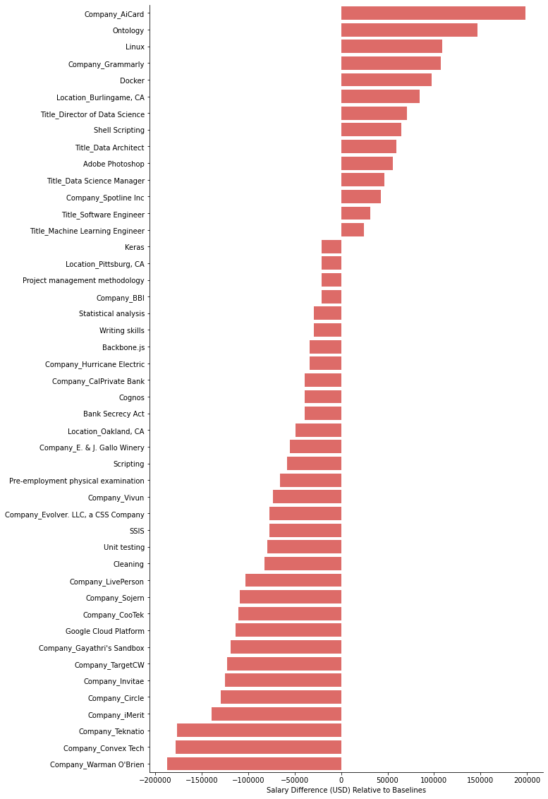

# SimplyHired Data Science Jobs EDA

This repository is for the analysis of data science jobs posted to the website (SimplyHired)[https://www.simplyhired.com/]. Below you will find an overview of the data collection, data cleaning, and exploratory data analysis results. I created this project to help me understand the types of jobs in data science, their qualifications and benefits, best locations, and salary ranges.

### Code Used 

**Python Version:** 3.9.7 <br />
**Packages:** numpy, pandas, scipy, matplotlib, seaborn, statsmodels, scikit-learn, selenium, re, ast, <br />
**For Web Framework Requirements:**  ```pip install -r requirements.txt```  

## Files

### scraping/scraper.py

This Python script is used to scrape SimplyHired search results for "data science" job postings with a location set to "California". The output is a dataframe named raw_data.csv which is located in the scraping directory.

### data_cleaning/data_cleaning.py

This Python script cleans the raw_data.csv file after scraping SimplyHired for job postings. The output of this file are two sets of dataframes. The first set are for EDA without imputation and the second set are for an OLS analysis where the data has been imputed. The first set includes df_benefits.csv, df_qualifications.csv, and df_title_loc_comp_salary.csv, and the second set includes df_modeling.csv, df_modeling_drop_first.csv, and dropped_columns.csv. All dataframes are located in the data_cleaning directory.

### EDA.ipynb

This Jupyter Notebook file contains the exploratory data analysis of the cleaned data (without imputation) and the OLS analysis (of the imputed data).

## Data Collection

## Data Cleaning

## EDA

Below are a few selected figures found in EDA.ipynb:

<div align="center">
<figure>
<br/>
  <figcaption>Figure 1: Boxplots for salaries by job title.</figcaption>
</figure>
</div>

</br>
</br>
  
<div align="center">
<figure>
<br/>
  <figcaption>Figure 2: Barplot of qualifications for data scientist job title.</figcaption>
</figure>
</div>

</br>
</br>

<div align="center">
<figure>
<br/>
  <figcaption>Figure 3: Barplot of benefits for data scientist job title.</figcaption>
</figure>
</div>

</br>
</br>

<div align="center">
<figure>
<br/>
  <figcaption>Figure 4: Barplot of companies most frequently hiring data scientists.</figcaption>
</figure>
</div>

</br>
</br>

<div align="center">
<figure>
<br/>
  <figcaption>Figure 5: Barplot of most frequent locations for data scientist job postings.</figcaption>
</figure>
</div>

</br>
</br>

<div align="center">
<figure>
<br/>
  <figcaption>Figure 6: Statistically significant predictors from ordinary least squares analysis and their impact on salary.</figcaption>
</figure>
</div>

## Resources

1. [PlayingNumbers/ds_salary_proj](https://github.com/PlayingNumbers/ds_salary_proj)
