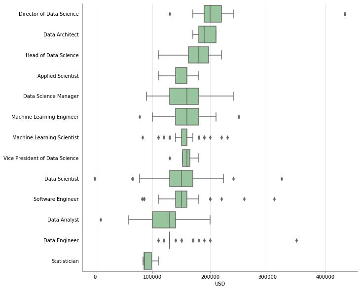
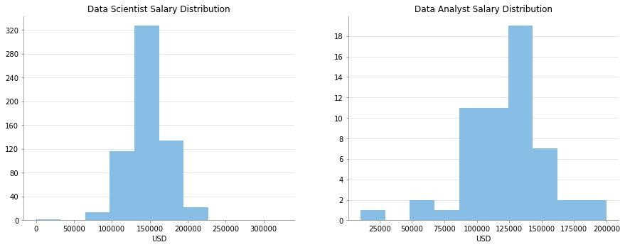
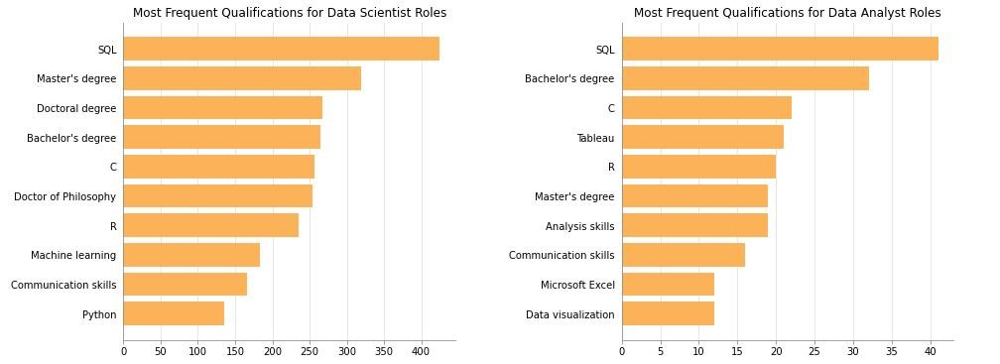
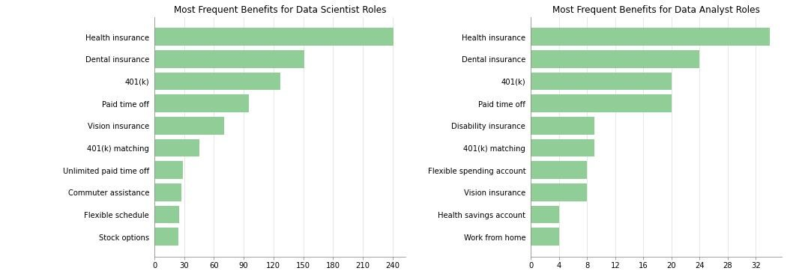
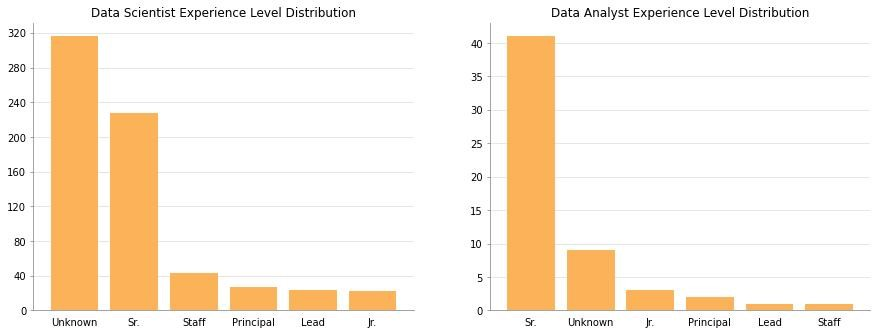
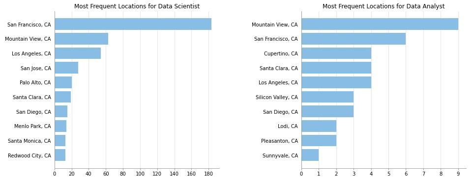
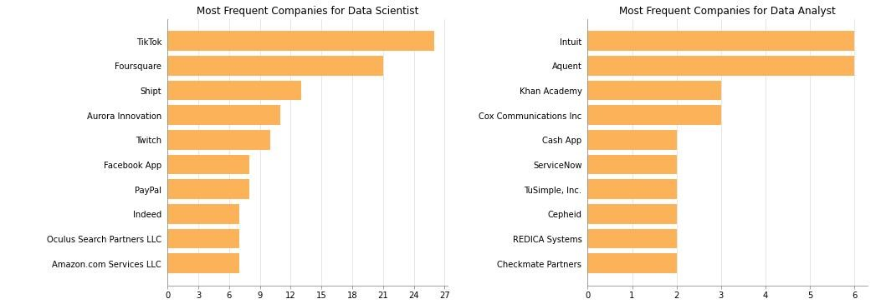

# SimplyHired Data Science Jobs EDA

This repository is for the analysis of data science jobs posted to the website [SimplyHired](https://www.simplyhired.com/). Below you will find an overview of the data collection, data cleaning, and exploratory data analysis results. I created this project to help me understand the types of jobs in data science, their qualifications and benefits, locations, and salary ranges. I am most interested in Data Scientist and Data Analyst positions, so that is what this repository focuses on.

### Project Outcome

### Code Used 

**Python Version:** 3.9.7 <br />
**Packages:** numpy, pandas, scipy, matplotlib, seaborn, statsmodels, scikit-learn, selenium, re, ast, <br />
**Requirements:**  ```pip install -r requirements.txt```  

## Files

### scraping/scraper.py

This Python script is used to scrape SimplyHired search results for "data science" job postings with a location set to "California." The output is a dataframe named raw_data.csv which is located in the scraping directory.

### data_cleaning/data_cleaning.py

This Python script cleans the raw_data.csv file. The output of this file are two sets of dataframes. The first set are for EDA without imputation and the second set are for an OLS analysis where the data has been imputed. The first set includes df_benefits.csv, df_qualifications.csv, and df_title_loc_comp_salary.csv, and the second set includes df_modeling.csv, df_modeling_drop_first.csv, and dropped_columns.csv. All dataframes are located in the data_cleaning directory.

### EDA.ipynb

This Jupyter Notebook file contains the exploratory data analysis of the cleaned data (without imputation).

### OLS_Analysis.ipynb

This Jupyter Notebook file contains the OLS analysis (of the imputed data).

## Data Collection

The data was collected on December 17, 2021. The postings were from Aug 17, 2021 and Dec 17, 2021. The total number of postings collected was 1342. The number of pages was limited to 99 which corresponds to 1342 postings. The job board SimplyHired was chosen because it offered salaries for most positions and had the benefits and qualifications conveniently seperated from the body of the post.

## Data Cleaning

The following changes were made to the scraped data prior to imputation:
* job titles were broken into a "Levels" column (such as "Jr.", "Sr.", etc.) and a "Title" column (such as "Data Scientist", "Data Analyst", etc.),
* company ratings were removed from the company names,
* job postings which were not specific to California were removed,
* job postings which did not specify a city were assigned an NaN for Location,
* text and symbols were removed from salaries, a single digit salary was calculated where ranges were given, and hourly salaries were converted to annual, and
* benefits and qualifications were seperated from each other, and two binary matrices were created with each column corresponding to a different benefit or qualification.

The non-imputed cleaned dataframes were then exported for EDA.

The following changes were made to the non-imputed dataframes for the OLS analysis:
* missing company, location, and qualifications were imputed using SimpleImputer set to "most_frequent", and
* missing salary was imputed using KNNImputer where the optimal parameters were determined using the non-missing data and KNeighborsRegressor.

## EDA

Below are some of the highlights from the EDA. Since I am primarily interested in Data Analyst and Data Scientist roles, this is what the selected figures present. Other roles can be found either in the EDA.ipynb Jupyter Notebook or output/eda folder.

Data Scientist and Data Analyst roles are among the lowest paid in data science. The highest paying jobs are data science manager/director type roles, machine learning research roles which mostly require doctoral degrees, and more computer science centric roles such as the Machine Learning Engineer. The lowest paid roles in data science are Statisticians.

<br/>
<div align="center">
<figure>
<br/>
  <figcaption>Figure 1: Boxplots for salaries by job title.</figcaption>
</figure>
</div>
<br/><br/>

For the Data Scientist role the mean salary is $147K and median salary is $150K whereas for the Data Analyst role the mean salary is $123K and median salary is $130K. There were eight times as many job postings for Data Scientists than for Data Analysts.


<br/>
<div align="center">
<figure>
<br/>
  <figcaption>Figure 2: Distribution of salaries for Data Scientist and Data Analyst roles.</figcaption>
</figure>
</div>
<br/><br/>


The number one skill that companies are looking for in Data Scientists and Data Analysts is SQL. 63% of Data Scientist job posts and 72% of Data Analyst job posts mention SQL. Other top technical skills mentioned by Data Scientist posts are C (39%), R (36%), machine learning (28%), and Python (20%). Other top technical skills mentioned by Data Analyst posts are C (39%), Tableau (37%), R (35%), analysis skills (33%), Microsoft Excel (21%), and data visualization (21%). The educational barrier of entry for Data Scientist roles is higher than the Data Analyst. The most frequently required level of education for the Data Scientist roles is a Master's degree (with 48% mentioning the degree) followed closely by a Doctoral degree (40%) and Bachelors degree (40%). In contrast, for Data Analyst roles 56% of posts mention a Bachelor's degree and only 33% mention a Master's degree. 


<br/>
<div align="center">
<figure>
<br/>
  <figcaption>Figure 3: Barplots of most frequently mentioned skills for Data Scientist and Data Analyst roles.</figcaption>
</figure>
</div>
<br/><br/>


The job benefits were similar for both Data Scientists and Data Analysts with health insurance, dental insurance, 401(k), and paid time off being the top four most frequently offered for both.

<br/>
<div align="center">
<figure>
<br/>
  <figcaption>Figure 4: Barplots of the most frequent benefits offered by companires hiring for Data Scientist and Data Analyst roles.</figcaption>
</figure>
</div>
<br/><br/>


The years of experience required to become a Data Scientist was more ambiguous than it was for the Data Analyst role. Most companies are looking to hire experienced Data Scientists and Data Analysts with 35% of Data Scientist posts and 71% of Data Analyst posts looking for senior-level applicants.


<br/>
<div align="center">
<figure>
<br/>
  <figcaption>Figure 5: Barplot for experience level distribution for Data Scientist and Data Analyst roles.</figcaption>
</figure>
</div>
<br/><br/>

The salaries are above the national average for these roles because the majority of positions are located in areas of high living expense. 28% of Data Scientist job posts are from San Francisco, 10% from Mountain View, and 8% from Los Angeles. For Data Analyst posts, 15% are from Mountain View and 11% are from San Francisco.


<br/>
<div align="center">
<figure>
<br/>
  <figcaption>Figure 6: Barplots of the most frequent locations of companies hiring for Data Scientist and Data Analyst roles.</figcaption>
</figure>
</div>
<br/><br/>


The companies with the most posts for Data Scientists on this specific job board are TikTok (4%) and Foursquare (3%), and for Data Analysts are Intuit (11%) and Aquent (11%). 


<br/>
<div align="center">
<figure>
<br/>
  <figcaption>Figure 7: Barplots of the most frequent companies hiring for Data Scientist and Data Analyst roles.</figcaption>
</figure>
</div>
<br/><br/>

## Resources

1. [PlayingNumbers/ds_salary_proj](https://github.com/PlayingNumbers/ds_salary_proj)
2. Show Me the Numbers (Second Edition) by Stephen Few
3. An Introduction to Statistical Learning (Second Edition) by Gareth James, Daniela Witten, Trevor Hastie, and Rob Tibshirani
4. [Testing assumptions of linear regression](https://towardsdatascience.com/verifying-the-assumptions-of-linear-regression-in-python-and-r-f4cd2907d4c0)
5. [Testing assumptions of linear regression in Python](https://jeffmacaluso.github.io/post/LinearRegressionAssumptions/)
6. [Chi-square test diagram](https://www.isixsigma.com/dictionary/chi-square-test/)
7. [Linear regression assumptions](https://www.analyticsvidhya.com/blog/2016/07/deeper-regression-analysis-assumptions-plots-solutions/)
